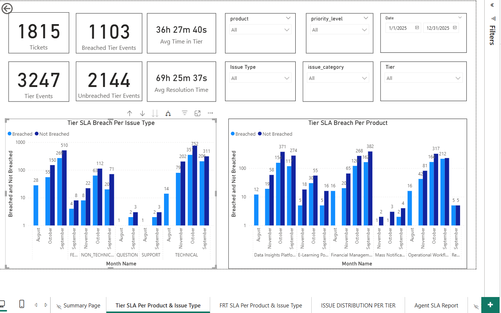

# 🎫 IT Support Issue Tracker & Performance Dashboard

## 📊 Dashboard Preview
[👉 Click Here to View the Interactive Dashboard](https://app.fabric.microsoft.com/view?r=eyJrIjoiY2YxZDJjNmEtZjIzYi00ZWMzLWE1MmItOWUzMDg2ZjU0MDc0IiwidCI6Ijc0OThmYWE3LTQ5NWMtNDk3MS1hZWYxLTQ1NDFjNWE0MDkxMiJ9)




   

## 📖 Executive Summary

This project is a full-stack data analysis solution designed to optimize an IT support ticketing system. By analyzing the lifecycle of support tickets—from creation to resolution—this dashboard provides actionable intelligence on **Service Level Agreement (SLA) compliance**, **agent performance**, and **escalation efficiency**.

The workflow demonstrates a complete data pipeline:
1. **Extraction:** Complex SQL queries extracted raw data and calculated time-based metrics (e.g., *Time in Tier*).
2. **Transformation:** A Python script successfully anonymized sensitive PII (Client Names, Staff) using tokenization and generalized product names to ensure data privacy.
3. **Visualization:** A Power BI dashboard enables stakeholders to drill down into performance metrics by Region, Product, and Agent.

---

## 📊 Dashboard Insights & Results

*Below is a summary of the key performance indicators (KPIs) derived from the analysis.*

### 1. SLA Compliance & Response Times
The primary goal of the support team is to minimize First Response Time (FRT) and the time taken to resolve or escalate an issue. These metrics ensure that the Resolution Time does not breach SLA, or if it does, allow the CX Manager to easily identify the bottleneck.

A major challenge with the data is that it can be misleading to measure SLA breach "per issue" since most issues escalate across multiple tiers. An issue might breach SLA in one tier but not another. Additionally, different tiers have unique, varying SLA agreements depending on issue urgency.

* **Overall SLA Breach Rate:** **34%** of Tier Events breached their SLA, while **30%** of Tier Events breached FRT.
* **SLA Timelines:**
    * The team typically responds to new issues within **34 hrs, 27 mins**.
    * Issues spend an average of **364 hrs** in Tiers.
    * The average Resolution Time is **69 hrs, 25 mins**.
    * The average Closing Time is **97 hrs, 52 mins**.

**Critical Insights:**
> * **Adoption Spike:** The months with the highest ticket volume were September and October. While this aligns with school opening/closing schedules, the issue tracker was adopted in July, suggesting this spike may also be driven by tool adoption rather than a pure increase in issues.
> * **SLA Discrepancy:** The high average FRT and Resolution Times—contrary to the relatively low % of breaches—stem from the fact that a significant number of issues are "Medium" and "Low" priority, which have longer SLA allowances. However, while most issues don't breach SLA, the outliers that do breach tend to exceed expected timelines by massive margins.

### 2. Escalation & Efficiency
Tracking the movement of tickets between support tiers (Tier 1 vs. Tier 2/3).

* **Resolution Efficiency:** There was no significant difference in SLA breach rates across tiers, despite **76%** of issues making it to Tier 2 and **42%** reaching Tier 3.
* **Bottleneck Identification:** Tickets spent an average of:
    * **30 hrs, 18 mins** in Tier 1.
    * **39 hrs, 51 mins** in Tier 2.
    * **43 hrs, 38 mins** in Tier 3.
    * *Note:* The longer waits in Tiers 2 and 3 align with expectations, as these tiers handle complex issues and have higher SLA allowances.

### 3. Volume Drivers by Product
Understanding which products generate the most support load.

* **Lowest Volume Drivers:** The **Mass Notification System**, **Proximity Tracking Tool**, and **Resource Pulling App** combined accounted for only **1.2%** of tickets, which aligns with their lower customer base (**5%**).
* **Root Cause Analysis:** Tier and FRT breaches were not strongly correlated with specific products or issue types, suggesting the bottlenecks pertain to **staffing capacity** rather than product defects.
* **Top Issue Types:**
    * **"Feature Requests"** and **"Technical Issues"** dominated, accounting for **45%** and **45%** of volume respectively.
    * **"Improvements"** and **"Questions"** made up only **2%** of the total issues.

---

## 🛠️ Technical Architecture

### Data Pipeline
* **SQL:** Utilized for robust data extraction. Key logic included calculating the precise difference in seconds between timestamps to derive `frt_seconds`, `resolution_time`, `closing_time`, and `time_in_tier`.
* **Python (Pandas):** Used for data cleaning and privacy protection.
    * *Anonymization:* Mapped real school names to tokens (e.g., "School 1") and generalized staff names.
    * *Date Parsing:* Implemented a multi-format date parser to handle inconsistent timestamp formats (`DD/MM/YYYY` vs ISO) from the source file.
* **Power BI:** Used for the final presentation layer, utilizing DAX measures for dynamic aggregation of SLAs.

### Repository Structure
```text
issue_tracker/
├── README.md                   # Project documentation
├── requirements.txt            # Python dependencies (pandas, openpyxl)
├── sql_queries/                # Logic for calculating FRT and Time in Tier
├── python_scripts/             # Anonymization and cleaning scripts
├── data/
│   ├── processed/              # Anonymized data used for the dashboard
│   └── raw/                    # (Excluded from repo for privacy)
├── dashboard/
│   ├── Portfolio_Dashboard.pbix # Interactive Power BI file
│   └── overview.png            # Static images of the report
└── documentation/
    └── Data_Dictionary.md      # Definitions of metrics and columns


---

## ⚙️ How to Run This Project
1.  **Clone the repo:** `git clone https://github.com/MuringiWangombe/ISSUE-TRACKER.git
2.  **Install dependencies:** `pip install -r requirements.txt`
3.  **Run the script:** `python python_scripts/issue_tracker_portfolio.py`

## 🛡️ Data Privacy Note
All data is strictly anonymized. No real PII (Personally Identifiable Information) is exposed.